# LAMP STACK IMPLEMENTATION

## STEPS 1-12

> Launch an EC2 instance on the virtual server (AWS, in this case)

### 1) Connect to the instance using your private key
   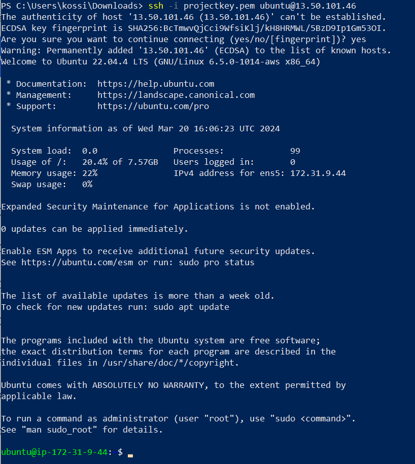

### 2) Install Apache2 on the machine
   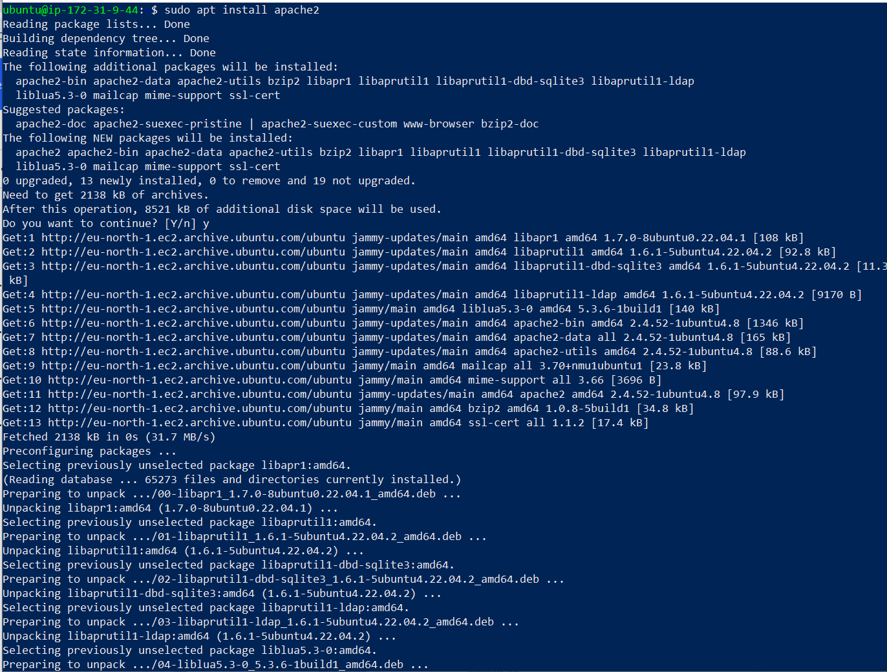

### 3) Check the status of the Apache server
   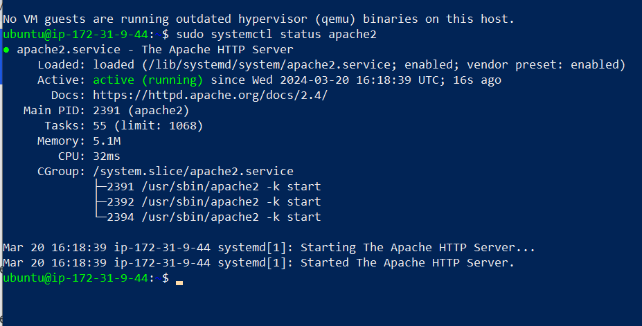

### 4) Connect to your public IP to test the Apache server
   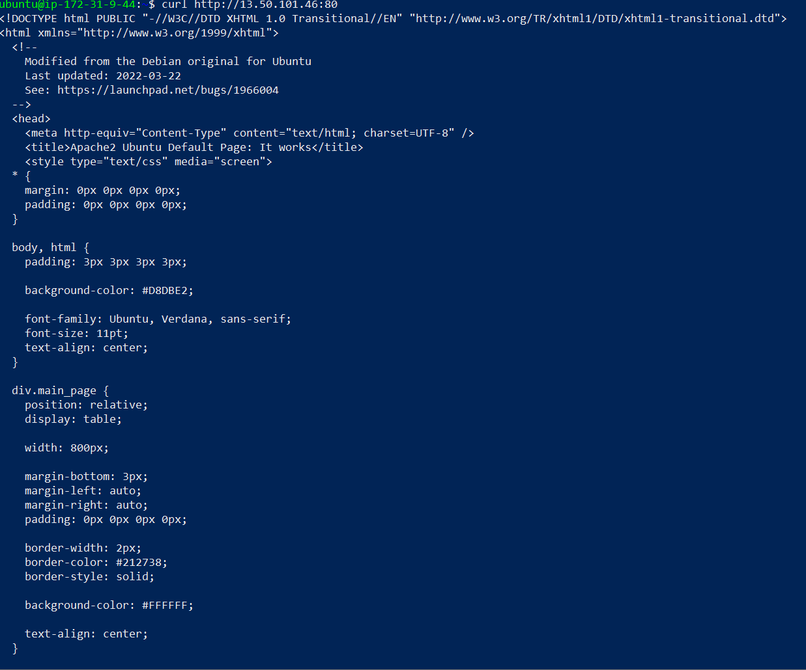

### 5) Install mysql on the machine
   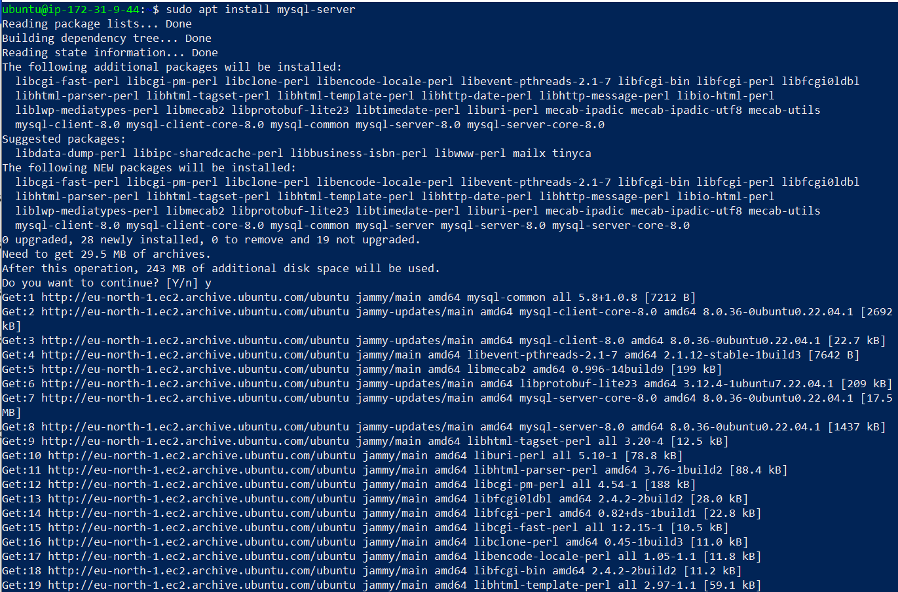

### 6) Log into mysql on the machine
   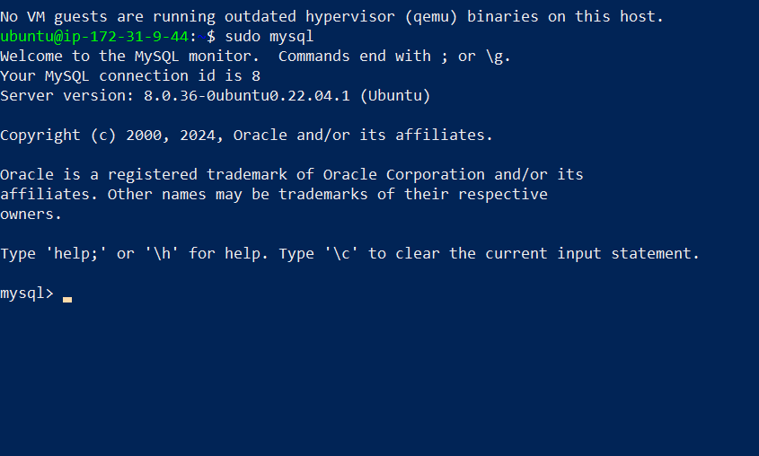

### 7) Run a secure installation for mysql
   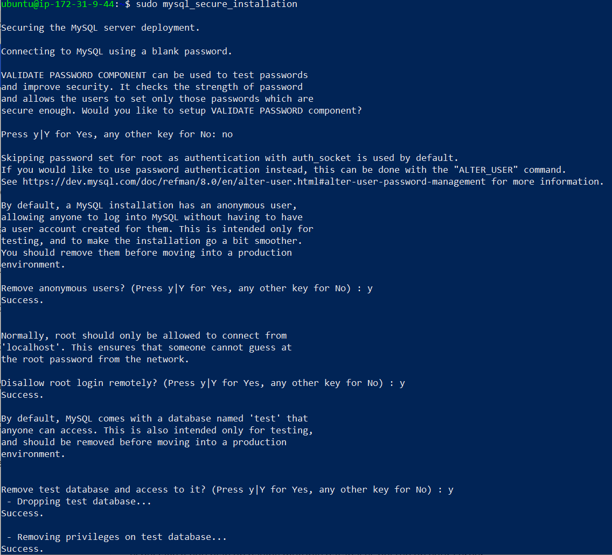

### 8) Install php packages on the machine
   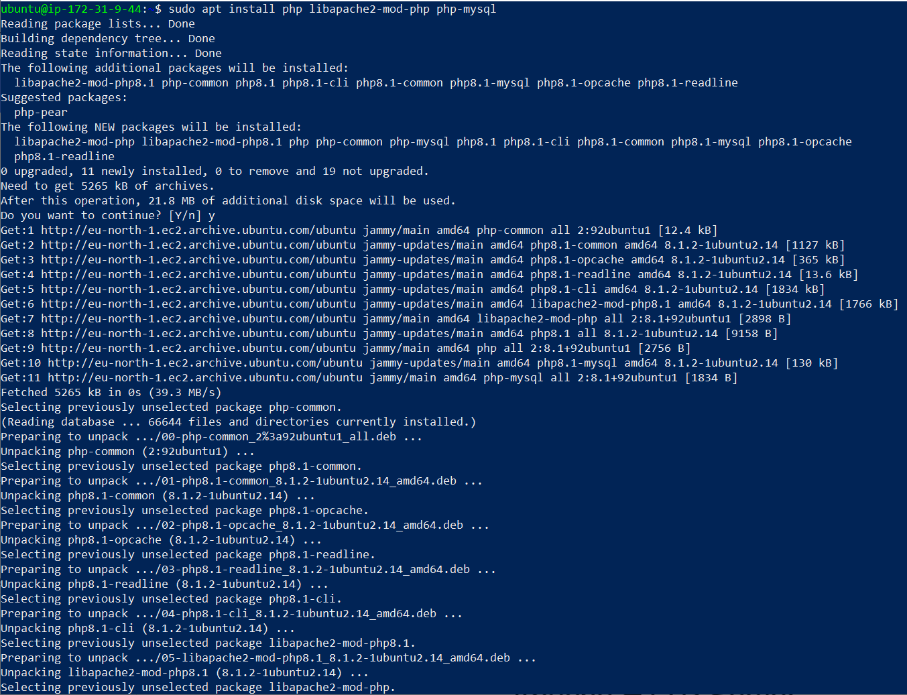

### 9) Check the current version of php installed
   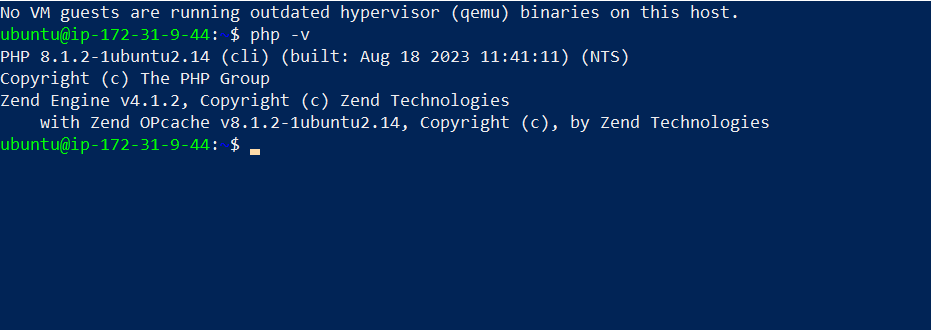

### 10) Enable the virtual host and disable Apache's default website
   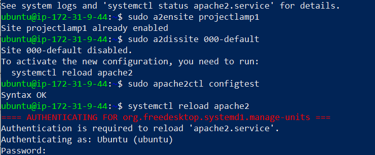

### 11) Testing a php script to confirm it's correctly installed
   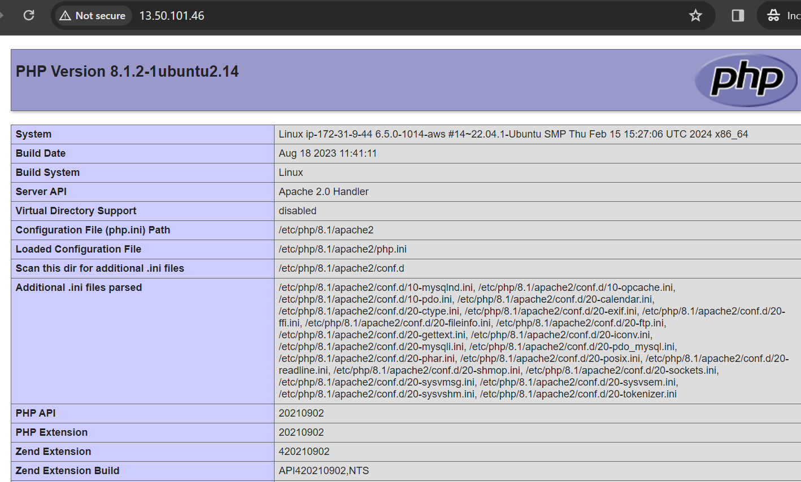

### 12) Configuration for virtual host setup
   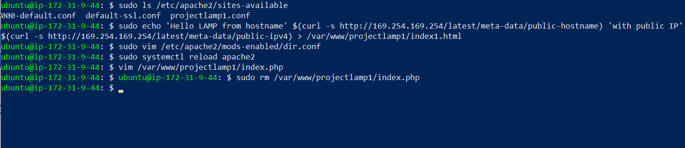

   
